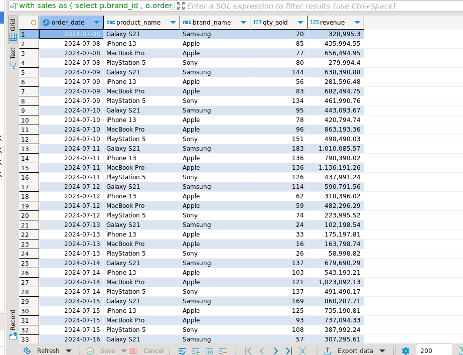
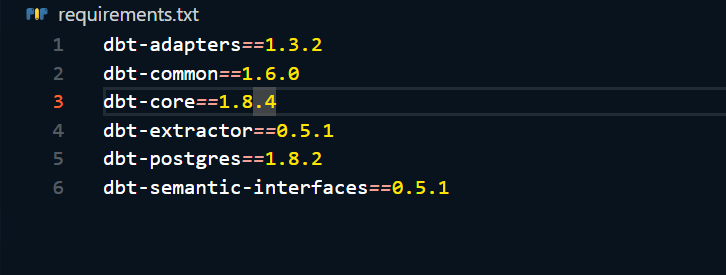

#### TASK 3 

Langkah-langkah setup dbt:

 1. buat venv
`python3 -m venv .venv`

2. Masuk ke dalam venv
`source .venv/bin/activate`

4. Jalankan docker 
`docker compose up`

5. Install dbt-postgres
`pip install dbt-postgres`

6. Melihat packages DBT apa saja yang sudah terinstall
`pip freeze| grep dbt`

7. Simpan list packages DBT ke dalam file requirements.txt
 `pip freeze | grep dbt >> requirements.txt`

8. Setup DBT project
`dbt init my_project`

