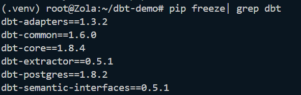
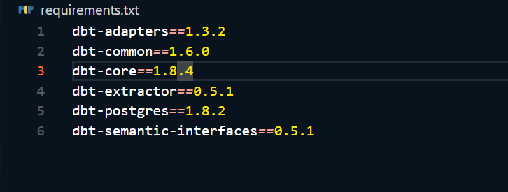
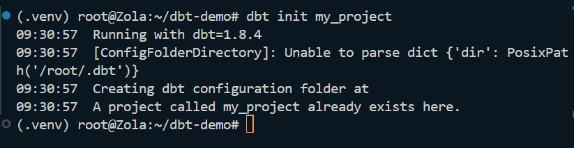
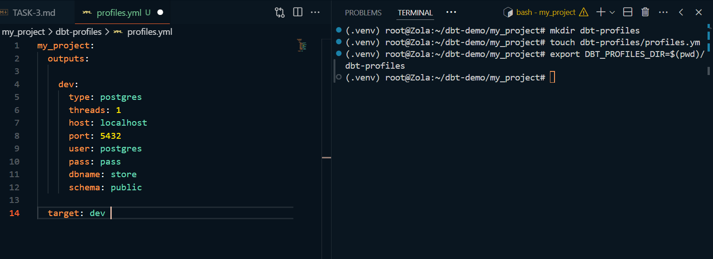
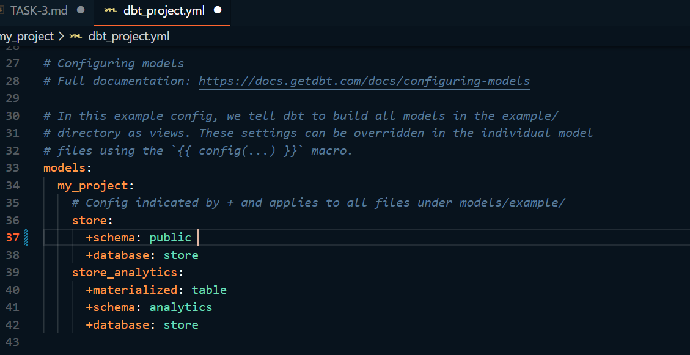
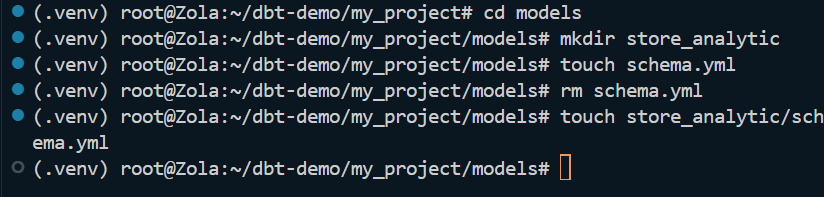
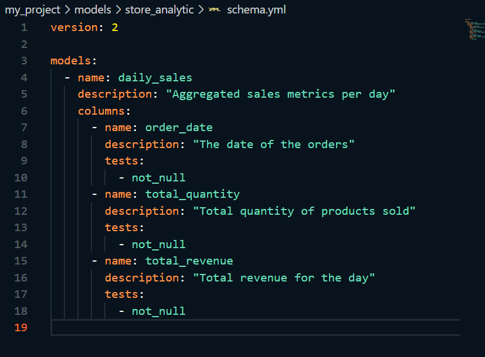
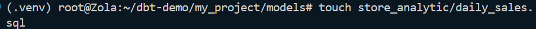
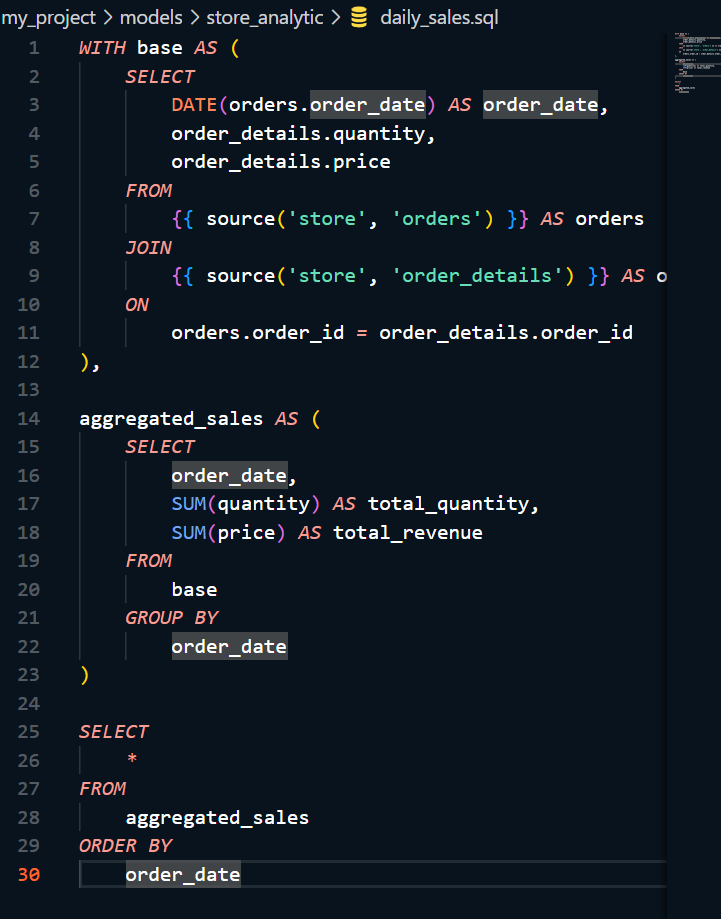

## TASK 3 

Langkah-langkah setup dbt:

 #### 1. buat venv
```
python3 -m venv .venv
```

#### 2. Masuk ke dalam venv
```
source .venv/bin/activate
```

#### 4. Jalankan docker 
```
docker compose up
```


#### 5. Install dbt-postgres
```
pip install dbt-postgres
```


#### 6. Melihat packages DBT apa saja yang sudah terinstall
```
pip freeze| grep dbt
```



#### 7. Simpan list packages DBT ke dalam file requirements.txt
 ```
 pip freeze | grep dbt >> requirements.txt
 ```



#### 8. Setup DBT project
```
dbt init my_project
```



Secara default, DBT akan menbuat sebuah dbt profile di home directory `~/.dbt/profiles.yml`

untuk membuat dbt-profile direktori baru, kita bisa menjalankan:
```
mkdir dbt-profiles

touch dbt-profiles/profiles.yml

export DBT_PROFILES_DIR=$(pwd)/dbt-profiles
```


#### 9. Setup DBT project congfiguration

pastikan models di dbt_project.yml terlihat seperti ini:
```
models:
  my_project:
    # Config indicated by + and applies to all files under models/example/
    store:
      +schema: public
      +database: store
    store_analytics:
      +materialized: table
      +schema: analytics
      +database: store

``` 


#### 10. Membuat model baru
- buat direktori store_analytic di dalam direktori models `mkdir store_analytic`
`touch store_analytic/schema.yml`



- Kemudian definisikan `schema.yml`



- Kemudian definisikan tabel dengan menambah file `daily_sales.sql` di dalam direktori yang sama.





#### 11. Run dan test model
```
cd my_project
dbt run
dbt test
```


